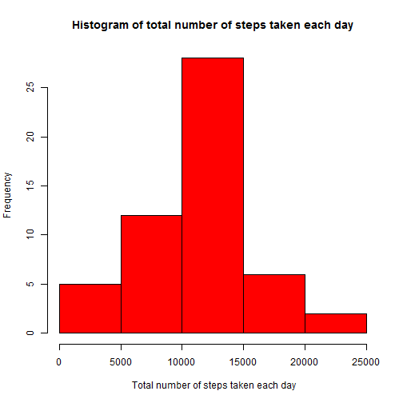
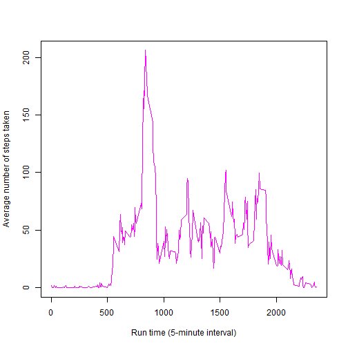
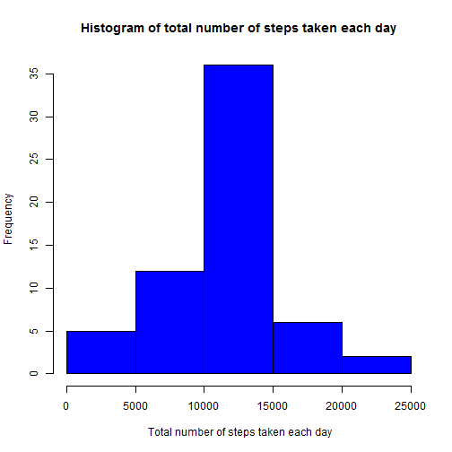
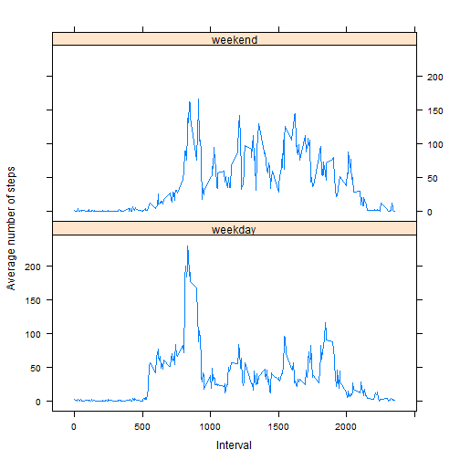

# Reproducible Research: Peer Assessment 1


## Loading and preprocessing the data

 


Load activity data **activity.csv** and convert dates column to **R Date class**


```r
activity.data <- read.csv("activity.csv")
activity.data$date <- as.Date(activity.data$date, "%Y-%m-%d")
```


## What is mean total number of steps taken per day?

```r
# Use tapply to find the total number of steps taken each day
steps.day <- tapply(activity.data$steps, activity.data$date, sum)

# Histogram of the total number of steps taken each day
hist(steps.day, main = "Histogram of total number of steps taken each day", 
    xlab = " Total number of steps taken each day", col = "red")
```

 

```r

# Mean of total number of steps taken per day
mean(steps.day, na.rm = T)
```

```
## [1] 10766
```

```r

# Median of total number of steps taken per day
median(steps.day, na.rm = T)
```

```
## [1] 10765
```


## What is the average daily activity pattern?


```r
# Plot of the 5-minute interval and the average number of steps taken,
# averaged across all days
steps.avg <- tapply(activity.data$steps, activity.data$interval, mean, na.rm = T)
plot(row.names(steps.avg), steps.avg, type = "l", col = "magenta", xlab = "Run time (5-minute interval)", 
    ylab = "Average number of steps taken")
```

 


```r
# The 5-minute interval that contains the maximum number of steps
maxnum <- which.max(steps.avg)
names(maxnum)
```

```
## [1] "835"
```


## Imputing missing values


```r
# nrow(activity.data)
missing <- table(complete.cases(activity.data))
missing[[1]]
```

```
## [1] 2304
```


**The number of missings elements are 2304**


```r
# Assigning a new dataframe and replacing the missing values with accross
# mean interval-time
newData <- activity.data

newData[1:288, 1] <- steps.avg
newData[2017:2304, 1] <- steps.avg
newData[8929:9216, 1] <- steps.avg
newData[9793:10080, 1] <- steps.avg
newData[11233:11520, 1] <- steps.avg
newData[11521:11808, 1] <- steps.avg
newData[12673:12960, 1] <- steps.avg
newData[17281:17568, 1] <- steps.avg


# Histogram of the total number of steps taken each day

steps.new <- tapply(newData$steps, newData$date, sum)

hist(steps.new, main = "Histogram of total number of steps taken each day", 
    xlab = " Total number of steps taken each day", col = "blue")
```

 

```r

# Mean of total number of steps taken per day
mean(steps.new)
```

```
## [1] 10766
```

```r

# Median of total number of steps taken per day
median(steps.new)
```

```
## [1] 10766
```


Theses values are not so different from the first part of the assignment. The effect of imputting the 
The impact of imputing missing data on the estimates of the total daily number of steps helps to get a cleaner data set but not necessarily changing the final outcome.

## Are there differences in activity patterns between weekdays and weekends?


```r
# Use the weekdays function to split the date variable to weekdays
# weekdays(newData$date)
newData$whichday <- weekdays(newData$date)
weekday <- c("Monday", "Tuesday", "Wednesday", "Thursday", "Friday")
weekend <- c("Saturday", "Sunday")
for (i in nrow(newData)) {
    if (newData[i, 4] %in% weekday) {
        newData$whichday[i] = "weekday"
    } else "weekend"
}
# newData$whichday %in% weekend = 'weekday'

# Assign the day of the week to either weekday or weekend
newData$whichday[newData$whichday == "Monday"] = "weekday"
newData$whichday[newData$whichday == "Tuesday"] = "weekday"
newData$whichday[newData$whichday == "Wednesday"] = "weekday"
newData$whichday[newData$whichday == "Thursday"] = "weekday"
newData$whichday[newData$whichday == "Friday"] = "weekday"
newData$whichday[newData$whichday == "Saturday"] = "weekend"
newData$whichday[newData$whichday == "Sunday"] = "weekend"
newData$whichday <- as.factor(newData$whichday)
```


```r
# Subgroup the dataframe to weekdays and weekends

weekdays <- subset(newData, newData$whichday == "weekday")
steps.weekday <- tapply(weekdays$steps, weekdays$interval, mean)

weekends <- subset(newData, newData$whichday == "weekend")
steps.weekend <- tapply(weekdays$steps, weekdays$interval, mean)

new <- aggregate(newData$steps, by = list(newData$interval, newData$whichday), 
    mean)
names(new) <- c("interval", "whichday", "averagesteps")
```


```r
library(lattice)
```

```
## Warning: package 'lattice' was built under R version 3.0.3
```

```r

xyplot(averagesteps ~ interval | whichday, data = new, layout = c(1, 2), type = "l", 
    xlab = "Interval", ylab = "Average number of steps")
```

 


